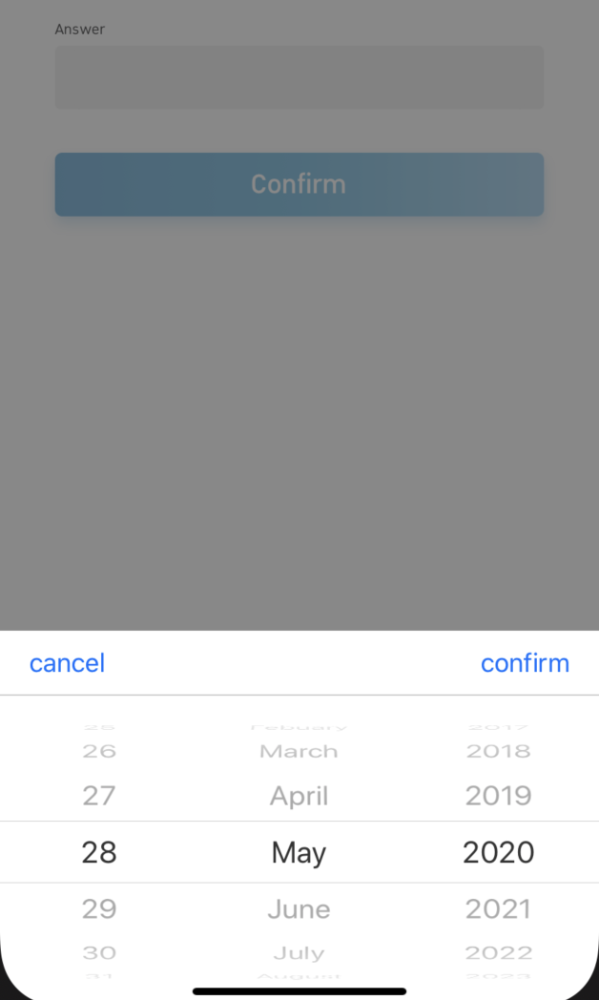
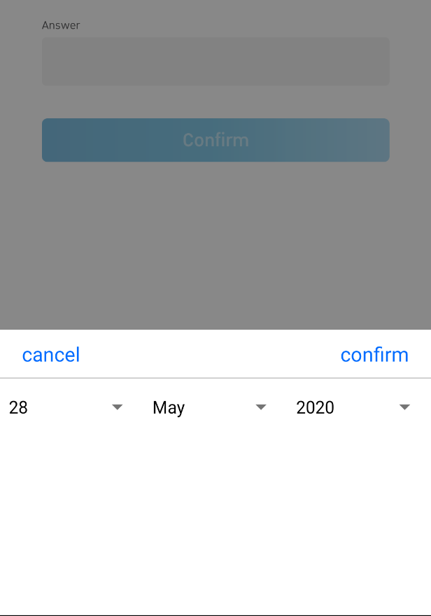

# React Native Datetime Picker

![Supports Android and iOS][support-badge]

This is a library forked from https://github.com/nysamnang/react-native-24h-timepicker/issues
the intention was to support buddhist year and modified min max date time.

I'll try my best to update this documentation.

### Screenshot

<table>
  <tr><td colspan=2><strong>Date Picker</strong></td></tr>
  <tr>
    <td><p align="center"></p></td>
    <td><p align="center"></p></td>
  </tr>
</table>


## Installation

```
npm i @sorakrisc/react-native-datetimepicker --save
```

### or

```
yarn add @sorakrisc/react-native-datetimepicker
```

## Usage

### Date Picker

```jsx
import {TimePicker, DatePicker, toBuddhistYear} from "react-native-24h-timepicker";
<DatePicker
          ref={ref => {
              this.DatePicker = ref;
          }}
          placeholder={'placeholder'}
          date={date}
          format={'DD/MM/YYYY'}
          inputComponent={<InputText
              pointerEvents="none"
              type={this.props.inputType}
              mt={26}
              label={Localized['question.answer']}
              maskOptions={this.props.inputMaskOptions}
              // value={toBuddhistYear(moment(this.state.date, 'DD/MM/YYYY'), 'DD MMM YYYY')}
              value={moment(this.state.date, 'DD/MM/YYYY')}
          />}
          minDate={moment().subtract(100, 'years')}
          maxDate={moment().add(100, 'years')}
          confirmBtnText={'confirm'}
          cancelBtnText={'cancel'}
          onConfirm={(date) => this.setDate(date)}
          // calendarType={'buddhist'}
          // monthList={[
          //     'มกราคม',
          //     'กุมภาพันธ์',
          //     'มีนาคม',
          //     'เมษายน',
          //     'พฤษภาคม',
          //     'มิถุนายน',
          //     'กรกฎาคม',
          //     'สิงหาคม',
          //     'กันยายน',
          //     'ตุลาคม',
          //     'พศจิกายน',
          //     'ธันวาคม'
          // ]}
      />
```

### Time Picker

```jsx
import React, { Component } from "react";
import { StyleSheet, View, TouchableOpacity, Text } from "react-native";
import TimePicker from "react-native-24h-timepicker";

class Example extends Component {
  constructor() {
    super();
    this.state = {
      time: ""
    };
  }

  onCancel() {
    this.TimePicker.close();
  }

  onConfirm(hour, minute) {
    this.setState({ time: `${hour}:${minute}` });
    this.TimePicker.close();
  }

  render() {
    return (
      <View style={styles.container}>
        <Text style={styles.text}>REACT NATIVE</Text>
        <Text style={styles.text}>24 HOURS FORMAT TIMEPICKER</Text>
        <TouchableOpacity
          onPress={() => this.TimePicker.open()}
          style={styles.button}
        >
          <Text style={styles.buttonText}>TIMEPICKER</Text>
        </TouchableOpacity>
        <Text style={styles.text}>{this.state.time}</Text>
        <TimePicker
          ref={ref => {
            this.TimePicker = ref;
          }}
          onCancel={() => this.onCancel()}
          onConfirm={(hour, minute) => this.onConfirm(hour, minute)}
        />
      </View>
    );
  }
}

const styles = StyleSheet.create({
  container: {
    flex: 1,
    alignItems: "center",
    backgroundColor: "#fff",
    paddingTop: 100
  },
  text: {
    fontSize: 20,
    marginTop: 10
  },
  button: {
    backgroundColor: "#4EB151",
    paddingVertical: 11,
    paddingHorizontal: 17,
    borderRadius: 3,
    marginVertical: 50
  },
  buttonText: {
    color: "#FFFFFF",
    fontSize: 16,
    fontWeight: "600"
  }
});

export default Example;
```

##### Props

| Prop           | Type     | Description                                    | Default |
| -------------- | -------- | ---------------------------------------------- | ------- |
| maxHour        | number   | Maximum of hour                                | 23      |
| maxMinute      | number   | Maximum of minute                              | 59      |
| hourInterval   | number   | The interval at which hours can be selected.   | 1       |
| minuteInterval | number   | The interval at which minutes can be selected. | 1       |
| hourUnit       | string   | Add extra text to hour                         | ""      |
| minuteUnit     | string   | Add extra text to minute                       | ""      |
| selectedHour   | string   | Default hour                                   | "0"     |
| selectedMinute | string   | Default minute                                 | "00"    |
| itemStyle      | object   | Item text style                                | {}      |
| textCancel     | string   | Cancel button text                             | Cancel  |
| textConfirm    | string   | Confirm button text                            | Confirm |
| onCancel       | function | Event on Cancel button                         |         |
| onConfirm      | function | Event on Confirm button                        |         |

##### Methods

| Method Name | Description      |
| ----------- | ---------------- |
| open        | Open TimePicker  |
| close       | Close TimePicker |

##### Note

Always set `ref` to `TimePicker` and call each method by using `this.TimePicker.methodName()` like example above.

## License

This project is licensed under the MIT License - see the [LICENSE.md](https://github.com/NYSamnang/react-native-24h-timepicker/blob/master/LICENSE) file for details

## Author
[Sorakris Chaladlamsakul](https://github.com/sorakrisc).
Originally from [NY Samnang](https://github.com/NYSamnang).


[support-badge]: https://img.shields.io/badge/platforms-android%20|%20ios-lightgrey.svg?style=flat-square
